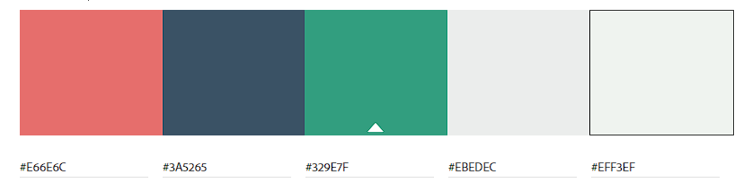

# FeedMe 

Feedme is a recipe sharing platform where the users can share their recipes with other's. The application consists of the React app and an API. 

Welcome to the React front end project section.

### Deployed app 

[Visit FeedMe](https://feedme-react.herokuapp.com/)

The repository for the Feedme API can be found here : [FeedMe API](https://github.com/NatasaMiric/feedme-api)

## Project Goals

The goal of this application is to give users the possibility to create, update and delete their recipes, as well as access to other user's recipes and profile. By liking and commenting on recipes, users can interact with each other and share their opinion about the website content.  

## Table of Content

* [UX](#UX) 
    * [User Stories](#User-Stories)          
    * [Wireframes](#Wireframes)
    * [Design](#Design)
        * [Color scheme](#Color-scheme)
        * [Typography](#Typography)
        * [Imagery](#Imagery)
    * [Project planning](#Project-planning)

* [Features](#Features)
  * [Existing features](#Existing-features)
  * [Future Features](#Future-features)
  
* [Technologies Used](#Technologies-Used)
  * [Languages Used](#Languages)
  * [Frameworks, Libraries & Programs](#Frameworks-Libraries-Programs) 

* [Testing](#Testing)

* [Deployment](#Deployment)

* [Credits](#Credits)    

* [Acknowledgments](#Acknowledgments)
----------------------------

## UX

### User Stories

| Category | As | I want to | so that I can | UI components |
| :--- | :--- | :--- | :--- | :--- |
| navigation | user | view a navbar from every page | navigate easily between pages | NavBar Component |
| navigation | logged out user | see sign in and sign up options | sign in/sign up | NavBar |
| navigation | user | navigate through pages quickly | view content seamlessly without page refresh | React Router Dom |
| auth | user | create a new account | access all the features for signed up users | Sign Up Form |
| auth| user | sign in to the app | access functionality for logged in users | Sign in Form |
| auth | user | tell if I am logged in or not | log in if I need to | NavBar |
| auth | user | maintain my logged-in status until I choose to log out | my user experience is not compromised | Refreshing access tokens |
| recipes | logged in user | create recipes | share my recipes with the people that have same interest for cooking like me | RecipeCreateForm |
| recipes | logged in user and recipe author | edit my recipe  | I can make corrections | Recipe, OptionsDropdownMenu, RecipeEditForm |
| recipes | logged in user and recipe author | delete my recipe  | I can manage my own recipes  | Recipe, OptionsDropdownMenu, Delete button |
| recipes | visiting user | view all the most recent recipes, ordered by most recently created first | be up to date with the newest content | RecipesPage |
| recipes | visiting user | keep scrolling through the recipes on the site, , that are loaded for me automatically | I don't have to click on "next page" etc | InfiniteScrollComponent |
| recipes |  visiting user  | see the most liked recipes| know which recipes are popular | RecipesPage, MostLikedRecipes |
| likes | logged in user | like a recipe | show my support to the author of the recipe | Recipe, Like icon |
| likes | logged in user | unlike a post | express that my interest has faded away | Recipe, (un) like icon |
| comments | logged in user | add comments to a recipe | share my thoughts about the recipe | RecipeDetailPage, CommentCreateForm |
| comments | visiting user | see how long ago a comment was made | know how old a comment is | Comment |
| comments | visiting user | read comments on recipe  | read what other users think about the recipe | RecipeDetailPage |
| comments | owner of a comment  | delete my comment | control removal of my comment from the application |RecipeDetailPage, Comment, OptionsDropdownMenu |
| comments | owner of a comment | edit my comment  | fix or update my existing comment |RecipeDetailPage, Comment, OptionsDropdownMenu, EditCommentForm|
| bookmarks | logged in user | bookmark the recipes | store the recipes that I like the most  | Recipe, bookmark icon |
| bookmarks | logged in user | view all bookmarked recipes | find easier the recipes that I planned to make | Bookmarks Page |
| bookmarks | logged in user| view the details of bookmarked recipe | know how to prepare it  | RecipeDetailPage, Bookmarks Page |
| profiles| logged in user | update my username and password | change my display name and keep my profile secure| ProfilePage |
| profiles| logged in user |  edit my profile  |  change my profile picture and bio | ProfilePage |
| profiles| visiting user | view all the recipes by a specific user | catch up on their latest recipes | Recipe, ProfilePage |
| profiles| visiting user | view other users profiles | see their posts and learn more about them | ProfilePage |
| profiles| visiting user |  view statistics about a specific user: bio,number of posted recipes | know how active they are | ProfilePage, Recipe |
| search | visiting user | search for recipes by author or title | find the recipes I am most interested in | RecipesPage |
| filter | visiting user | filter recipes by category and difficulty  | easier find the recipes that I am interested in | RecipesPage |

### Wireframes

### Design
#### Color scheme

The website color scheme is vibrant to achieve soothing appearance and make it fun. The goal is to boost in visitors positive and fun emotions.   

#### Typography

For the font I choose a [Google Font](https://fonts.google.com/) that is easy to read and has a variety of styles: 

* [Montserrat](https://fonts.google.com/specimen/Montserrat?query=monts)

#### Imagery

Images were used to enrich the content and convey to visitors the content of the site. 
All the images for the recipes posts have been borrowed from [unsplash](https://unsplash.com/).

### Project planning

The project was developed using an Agile approach by defining the epics and user stories that were implemented in 5 sprints, each lasting of one week.

I used the GitHub project for planning and creating epics and user stories that were broken into tasks and each user story had assigned labels according to the app that it belong to (API or React Front-End) and connected to the corresponding epic. MoSCoW prioritization was assigned to each user story to ensure that all core features are completed first.

I decided to have one Kanban board where will I implement issues for both API and frontend application which I considered more practical and can be accessed [here](https://github.com/users/NatasaMiric/projects/4/views/1) to see more details for each ticket.

## Features
### Existing features
### Future Features

## Technologies Used
### Languages Used

* HTML 
* CSS
* Java Script

### Frameworks, Libraries & Programs

* React 17.0.2 - used for building the UI components
* React Bootstrap 4.6.0 - specially designed for React components and used for styling and responsive design
* React-router-dom 5.3.0 -  simplifies the routing and navigation without the need to refresh the page
* axios - makes HTTP requests from the browser and handle the transformation of request and response data.
* react-infinite-scroll-component 6.1.0 - used for automatic loading of long lists of data
* JWT decode 3.1.2 

## Credits

This project was inspired by [Code Institute Moments project](https://github.com/Code-Institute-Solutions/moments)

Logo image: 
https://www.flaticon.com/free-icon/cooking_4478454?term=cooking&page=1&position=31&origin=search&related_id=4478454

Image on sign in and sign up page: 
https://unsplash.com/photos/hwy3W3qFjgM?utm_source=unsplash&utm_medium=referral&utm_content=creditCopyText"

No results image:
https://www.clipartmax.com/middle/m2H7H7H7H7b1i8b1_search-results-are-finished-no-results-found-cartoon/

### Acknowledgments

