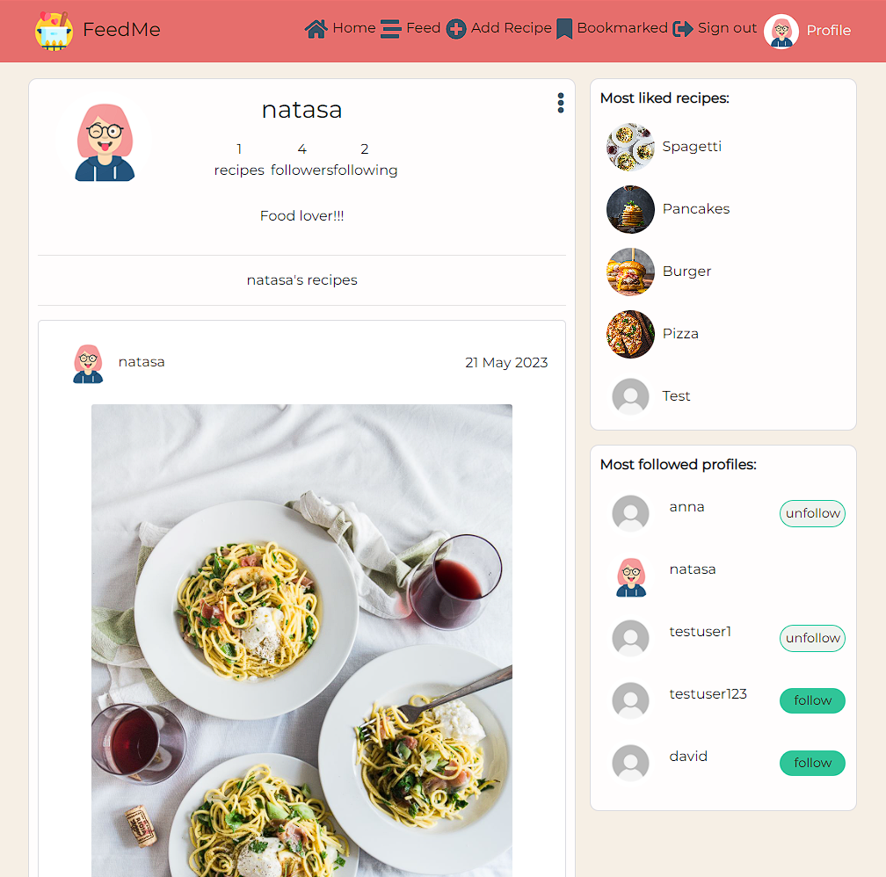

# FeedMe 

Feedme is a recipe sharing platform where the users can share their recipes with other's. The application consists of the React app and an API. 

Welcome to the React front end project section.

### Deployed app 

[Visit FeedMe](https://feedme-react.herokuapp.com/)

The repository for the Feedme API can be found here : [FeedMe API](https://github.com/NatasaMiric/feedme-api)

## Project Goals

The goal of this application is to give users the possibility to create, update and delete their recipes, as well as access to other user's recipes and profile. By liking, commenting on recipes and following other users, users can interact with each other and share their opinion about the website content.  

## Table of Content

* [UX](#UX) 
    * [User Stories](#User-Stories)          
    * [Wireframes](#Wireframes)
    * [Design](#Design)
        * [Color scheme](#Color-scheme)
        * [Typography](#Typography)
        * [Imagery](#Imagery)
    * [Project planning](#Project-planning)
* [Most reused components, context and hooks](#most-reused-components-hooks-and-contexts)
* [Features](#Features)
  * [Existing features](#Existing-features)
  * [Future Features](#Future-features)
  
* [Technologies Used](#Technologies-Used)
  * [Languages Used](#Languages)
  * [Frameworks, Libraries & Programs](#Frameworks-Libraries-Programs) 

* [Testing](#Testing)

* [Deployment](#Deployment)

* [Credits](#Credits)   

----------------------------

## UX

### User Stories

| Category | As | I want to | so that I can | UI components |
| :--- | :--- | :--- | :--- | :--- |
| navigation | user | view a navbar from every page | navigate easily between pages | NavBar Component |
| navigation | logged out user | see sign in and sign up options | sign in/sign up | NavBar |
| navigation | user | navigate through pages quickly | view content seamlessly without page refresh | React Router Dom |
| auth | user | create a new account | access all the features for signed up users | Sign Up Form |
| auth| user | sign in to the app | access functionality for logged in users | Sign in Form |
| auth | user | tell if I am logged in or not | log in if I need to | NavBar |
| auth | user | maintain my logged-in status until I choose to log out | my user experience is not compromised | Refreshing access tokens |
| recipes | logged in user | create recipes | share my recipes with the people that have same interest for cooking like me | RecipeCreateForm |
| recipes | logged in user and recipe author | edit my recipe  | I can make corrections | Recipe, OptionsDropdownMenu, RecipeEditForm |
| recipes | logged in user and recipe author | delete my recipe  | I can manage my own recipes  | Recipe, OptionsDropdownMenu, Delete button |
| recipes | visiting user | view all the most recent recipes, ordered by most recently created first | be up to date with the newest content | RecipesPage |
| recipes | visiting user | keep scrolling through the recipes on the site, , that are loaded for me automatically | I don't have to click on "next page" etc | InfiniteScrollComponent |
| recipes |  visiting user  | see the most liked recipes| know which recipes are popular | RecipesPage, MostLikedRecipes |
| recipes | logged in user | view followed users' posts  | keep up with my favourite users | RecipesPage |
| likes | logged in user | like a recipe | show my support to the author of the recipe | Recipe, Like icon |
| likes | logged in user | unlike a post | express that my interest has faded away | Recipe, (un) like icon |
| comments | logged in user | add comments to a recipe | share my thoughts about the recipe | RecipeDetailPage, CommentCreateForm |
| comments | visiting user | see how long ago a comment was made | know how old a comment is | Comment |
| comments | visiting user | read comments on recipe  | read what other users think about the recipe | RecipeDetailPage |
| comments | owner of a comment  | delete my comment | control removal of my comment from the application |RecipeDetailPage, Comment, OptionsDropdownMenu |
| comments | owner of a comment | edit my comment  | fix or update my existing comment |RecipeDetailPage, Comment, OptionsDropdownMenu, EditCommentForm|
| bookmarks | logged in user | bookmark the recipes | store the recipes that I like the most  | Recipe, bookmark icon |
| bookmarks | logged in user | view all bookmarked recipes | find easier the recipes that I planned to make | Bookmarks Page |
| bookmarks | logged in user| view the details of bookmarked recipe | know how to prepare it  | RecipeDetailPage, Bookmarks Page |
| profiles| logged in user | update my username and password | change my display name and keep my profile secure| ProfilePage |
| profiles| logged in user |  edit my profile  |  change my profile picture and bio | ProfilePage |
| profiles| visiting user | view all the recipes by a specific user | catch up on their latest recipes | Recipe, ProfilePage |
| profiles| visiting user | view other users profiles | see their posts and learn more about them | ProfilePage |
| profiles| visiting user |  view statistics about a specific user: bio,number of posted recipes | know how active they are | ProfilePage, Recipe |
| profile |  visiting user  | see the most followed profiles| know which profiles are popular | RecipesPage, MostFollowedRecipes |
| search | visiting user | search for recipes by author or title | find the recipes I am most interested in | RecipesPage |
| filter | visiting user | filter recipes by category and difficulty  | easier find the recipes that I am interested in | RecipesPage |
| followers | logged in user | follow a profile | show my interest in someone's content | Profile follow button |
| followers | logged in user | unfollow a profile | show that my interest in someone's content has faded away and remove their posts from my feed | Profile (un) follow button |

### Wireframes

Wireframes were made for desktop and mobile view.

* [Desktop](docs/wireframes/desktop/)

* [Mobile](docs/wireframes/mobile/)

### Design
#### Color scheme

The website color scheme is vibrant to achieve soothing appearance and make it fun. The goal is to boost in visitors positive and fun emotions.   

#### Typography

For the font I choose a [Google Font](https://fonts.google.com/) that is easy to read and has a variety of styles: 

* [Montserrat](https://fonts.google.com/specimen/Montserrat?query=monts)

#### Imagery

Images were used to enrich the content and convey to visitors the content of the site. 
All the images for the recipes posts have been borrowed from [unsplash](https://unsplash.com/).

## Project planning

The project was developed using an Agile approach by defining the epics and user stories that were implemented in 6 sprints (milestones), each lasting of approximately one week.

I used the GitHub project for planning and creating epics and user stories that were broken into tasks and each user story had assigned labels according to the app that it belong to (API or React Front-End) and connected to the corresponding epic. MoSCoW prioritization was assigned to each user story to ensure that all core features are completed first.

I decided to have one Kanban board where will I implement issues for both API and frontend application and it can be accessed [here](https://github.com/users/NatasaMiric/projects/4/views/1) to see more details for each ticket.

## Most reused components, hooks and contexts

### Components

* RecipesPage
  * Home, Feed, Bookmarked

* Recipe
  * RecipesPage

* Profile 
  * MostFollowedProfiles

* OptionsDropdown
  * Recipe, ProfilePage, Comment

* InfiniteScrollComponent
  * RecipePage (loading Comment components)
  * RecipesPage (loading all, feed or bookmarked Recipe components)
  * ProfilePage  (loading Recipe components that belong to the profile)

### Contexts

  * CurrentUserContext exposes the user state to the entire app. Relevant components can subscribe to its changes
  * ProfileDataContext exposes the profile state to the entire app. Enables the PopularProfiles component to be in sync with the ProfilePage contents
  * AlertContext exposes a nice alert popup and enables global use

### Hooks

* written to reduce repeatable state logic:
  * useClickOutsideToggle: enable toggle on the burger menu
  * useRedirect: enable redirect for users who are either logged in or logged out, depending on the use case
  * useAlert:  to access state and actions in AlertContext

## Features

### Existing features

* Logo 

  * It is featured on all pages on the website. It allows users to go back to the home page by clicking on it.

* Navigation bar

  * It is featured on all pages on website, fully responsive and includes links to Home page, Feed, Bookmarked, Sign In and Sign Up page for logged in users, and Home, Sign in and Sign up for logged out users.
  * Fixed on top of all pages to allow the user to easily navigate from page to page across all devices without having to revert to the previous page via the back button or scroll up.
  * Sorted out according to priority and it is consistent in style and color to enable easy navigation.
  * Navigation links are in the dropdown menu on smaller screen sizes.

  
  
  

* Home Page 

  * Displays the posted recipes, most liked recipes, most followed profiles and a search bar.
  * In search bar, users are able to search for recipes by title, author and ingredient.
  * Users are able to click on each recipe to access the recipe details (same in most liked recipes section).
  * Logged in users can like, comment and bookmark the recipe.
  * Users can access to another user profile by clicking on user's name or image on recipe or in most followed profiles list.
  * Logged in users can click on follow button to follow a user in most followed profiles section, or unfollow button to unfollow a user (desktop screens). 

  
  
  
* Sign Up page

  * It allows the user to register an account. It is required that the user writes a username and password.
  * It is a necessary step if the user wants to have more available features.
  * The user will receive a success message after signing up.

  
  

* Sign In page 

  * It allows the user to sign in to the account to be able to: add a recipe, edit a recipe, delete a recipe, comment the recipe, edit the comment, delete the comment, follow a user, unfollow a user, bookmark a recipe.  
  * The user will receive a success message after logging in.

  
    

* Recipe Detail page

  * Displays the recipe details: author, image, title, ingredients, instructions, category, difficulty, cooking time.
  * Logged in users can leave a comment, edit or delete a comment.
  * It provides the options menu where users can edit or delete their recipes.
  * When user selects editing the recipe, he gets redirected to recipe edit page where he can change all fields. 

* Add Recipe page

  * Logged in users can create a recipe by uploading an image and filling out the form fields:
  title, ingredients, instructions, category, difficulty and cooking time. 
  * After creating the recipe, users are redirected to home page and a message for successfuly created recipe is displayed. 

* Feed Page

  * It provides the same design as home page (logged in status), except that the diplayed recipes belong to users that logged in user has followed. 

* Bookmarked Page

  * It provides the same design as home page (logged in status), except that the displayed recipes are the ones that logged in user has bookmarked. 

* Profile 

  * It provides the information about the user: username, bio, number of posted recipes, followers and following. In this section is also a button to follow/unfollow a user. 
  * Contains all the recipes that user has posted.
  * Profile owner can edit his username, profile image, bio and password.

  
  
  
  
   
  
  
### Future Features

* Add filter option to filter the recipes by category and difficulty.
* Add rich text editor for ingredients and instructions field or create them as separate models in API so that it is possible to add each ingredient separately with measuring units, and instructions as steps.
* Enable multiple selection in recipe category field.
* Allow users to automatically create shoping lists based on the recipes they plan to make.
* Allow users to make a weekly meal plan.   

## Technologies Used

### Languages Used

* HTML 
* CSS
* Java Script

### Frameworks, Libraries & Programs

* React 17.0.2 - used for building the UI components
* React Bootstrap 4.6.0 - specially designed for React components and used for styling and responsive design
* React-router-dom 5.3.0 -  simplifies the routing and navigation without the need to refresh the page
* axios - makes HTTP requests from the browser and handle the transformation of request and response data.
* react-infinite-scroll-component 6.1.0 - used for automatic loading of long lists of data
* JWT decode 3.1.2 - used for decoding JWT tokens.
* [Eslinter](https://eslint.org/play/) - online linter tool for identifying and reporting on patterns in JavaScript
* Cloudinary - for free image hosting
* Heroku - used for hosting the application
* Git - used for version control
* GitHub - project repository

## Testing

All testing details can be found [here](TESTING.md)

## Deployment

* Workspace setup

Set up a new repository on Github
    2. Open the workspace on Gitpod using the green Gitpod button
    3. In ther terminal enter the following command:
     npx create-react-app . --template git+https://github.com/Code-Institute-Org/cra-template-moments.git --use-npm
    4. Enter y to confirm installing the create-react-app package
    5. Start the app with:
    npm start

* Deployment

  * add prebuild script
  * add Procfile
  * remove all console.logs
  * use Bootstrap default imports to minimize the build
  * deploy to Heroku:
    1. Create new Heroku app
    2. Link the Heroku app to the GitHub repository
    3. Go to Deploy and select deploy branch on the bottom of the page(make sure that the final version of the code is pushed on terminal)

## Credits

This project was inspired by [Code Institute Moments project](https://github.com/Code-Institute-Solutions/moments) 

Code Institute template for setting up the project: 

The initial template for the project was made by [Code Institute](https://github.com/Code-Institute-Org/cra-template-moments)

Logo image: 
https://www.flaticon.com/free-icon/cooking_4478454?term=cooking&page=1&position=31&origin=search&related_id=4478454

Image on sign in and sign up page: 
https://unsplash.com/photos/hwy3W3qFjgM?utm_source=unsplash&utm_medium=referral&utm_content=creditCopyText"

No results image:
https://www.clipartmax.com/middle/m2H7H7H7H7b1i8b1_search-results-are-finished-no-results-found-cartoon/

