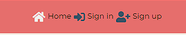
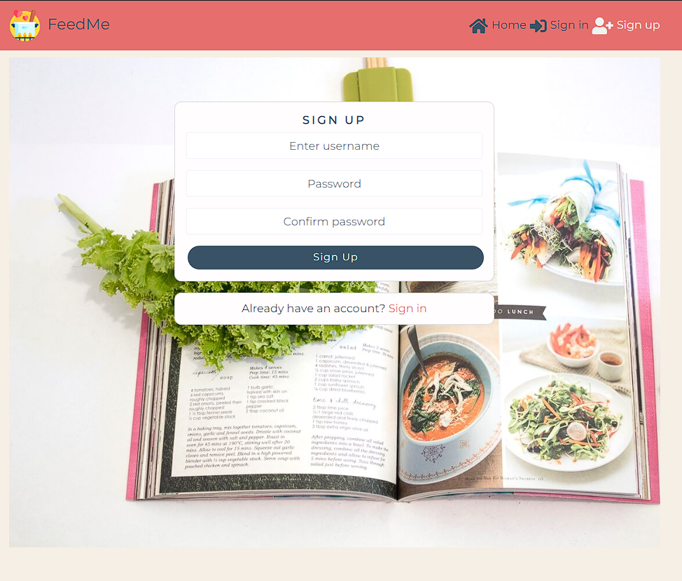
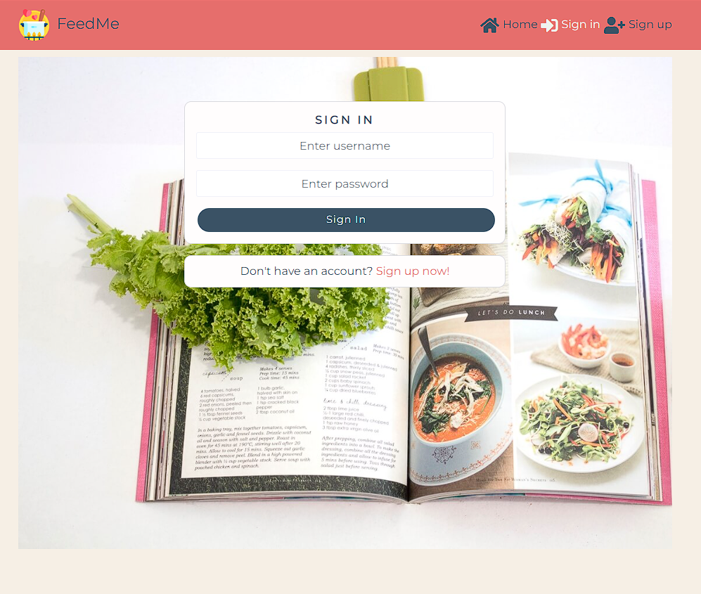
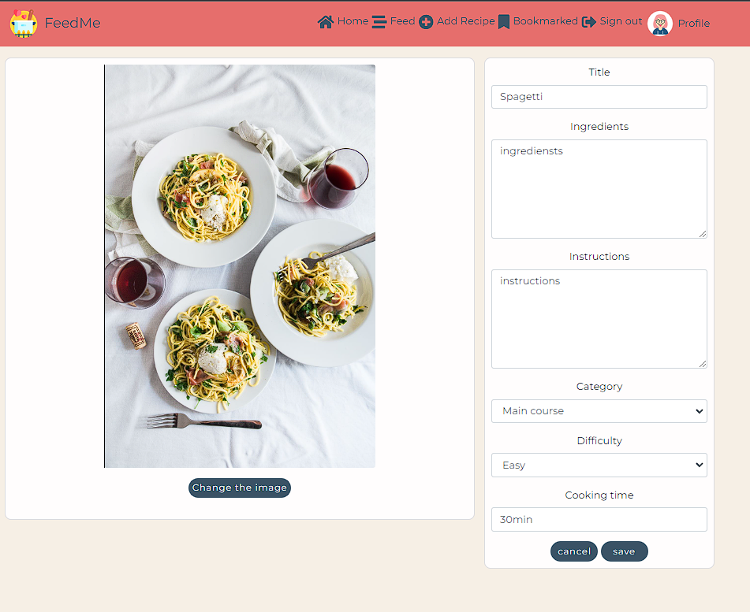
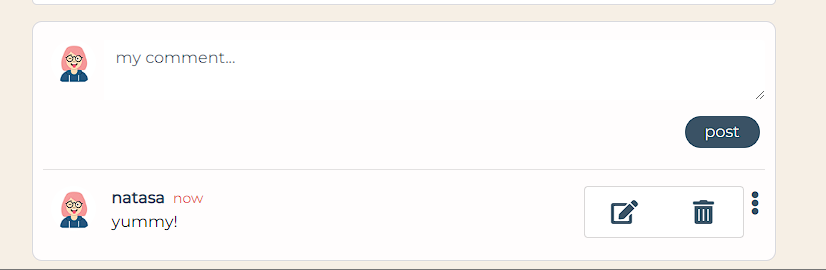
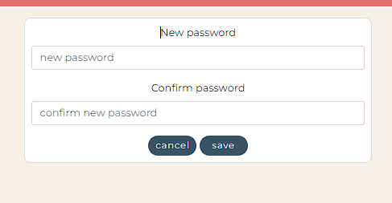
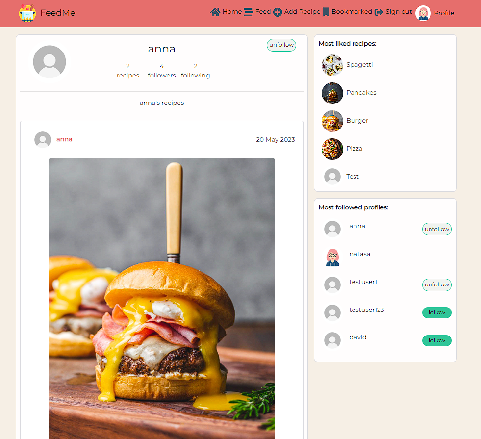

# Testing

* [Validator Testing](#validator-testing)
    * [Lighthouse](#lighthouse) 
* [Manual testing](#manual-testing)
    * [Testing User Stories](#testing-user-stories)
    * [Full testing](#full-testing)
* [Bugs](#bugs)

## Validator testing

All Java Script code has been checked on online [eslinter](https://eslint.org/play/) and there wasn't any reported error. 

The CSS code has been checked on [W3C CSS Jigsaw validator](https://jigsaw.w3.org/css-validator/) and passed without errors. 

### Lighthouse

I have used Googles Lighthouse testing to test the performance, accessibility, best practices and SEO of the site.
Each page has been tested and the accessibility improvements have been made.
The performance score is impacted mostly because of images loading that are located on page and should be improved. 

* [Desktop results](docs/lighthouse/desktop/)

* [Mobile results](docs/lighthouse/mobile/)

## Manual testing

### Testing User Stories

| As a/an | I want to be able to ... | So that I can... | How is this achieved? | Evidence |
| :--- | :--- | :---| :--- | :---: |
| user | view a navbar from every page | navigate easily between pages | The navbar is located on top of every page |   | 
| logged out user | see sign in and sign up options | sign in/sign up | These options are located on navbar. If the user clicks on these link he should be redirected to sign in /sign up pages  |    |
| user | create a new account | access all the features for signed up users | The link for sign up is located in navbar that user should click and user will be redirected to sign up page. There should user fill out his username and password and click sign up button |  |
| user | sign in to the app | access functionality for logged in users | The link for sign in is located in navbar that user should click and user will be redirected to sign in page. There should user fill out his username and password and click sign in button |  |
| user | tell if I am logged in or not | log in if I need to | If the user is logged in, he should be able to see a sign out link on navbar. Otherwise, if the user is logged out, he will find the sign in link. |    |
| logged in user | create recipes | share my recipes with the people that have same interest for cooking like me | If the user is logged in,he should be able to see and click on Add recipe button that is located on navbar. This action will take user to create recipe page where the user should upload an image by clicking on upload image button, write content in all fields, select an option for category and difficulty and click on save button below the form |  |
| logged in user and recipe author | edit my recipe  | I can make corrections | User should click on recipe that he wants to edit then he will be redirected to recipe page where he should find three dots on top, right corner of the recipe and click on it. After click, there will be an icon for edit that user should click and will be redirected to edit recipe page. User should be able to make changes in every form field and upload another image by clicking on change image button  |  |   
| logged in user and recipe author | delete my recipe  | I can manage my own recipes  | User should click on recipe that he wants to delete then he will be redirected to recipe page where he should find three dots on top, right corner of the recipe and click on it. After click, there will be an icon for deleting that user should click on and there will pop up confirmation field to confirm if he wants to delete a recipe  |    |
| visiting user | view all the most recent recipes, ordered by most recently created first | be up to date with the newest content | User should be able to find the recipes ordered by most recent date by accessing the home page |   |
|  visiting user  | see the most liked recipes| know which recipes are popular | When the user clicks on home, feed and bookmarked page, the user should be able to see most liked recipes section on right side of the page |        |
| logged in user | view followed users' posts  | keep up with my favourite users |  When the user clicks on feed located on navbar, the user will be redirected to feed page where will be displayed the recipes by users that he follows |      |
| logged in user | like a recipe | show my support to the author of the recipe | When the user click on the heart icon located on recipe section, the heart will become red which means that the liking has succeded |   |
| logged in user | unlike a post | express that my interest has faded away | When the user clicks on the red heart located on recipe, the icon is going to switch to white color which show that unliking succeded |     |
| logged in user | add comments to a recipe | share my thoughts about the recipe | When the user clicks on recipe and gets redirected to another page, below the recipe will be displayed a comment form where user should write a text and click on post button |   |
| visiting user | see how long ago a comment was made | know how old a comment is | User should be able to find the time of each comment next to the name of the user taht posted the comment |       |
| visiting user | read comments on recipe  | read what other users think about the recipe | When user clicks on comment icon on recipe, he will be redirected to another page where will be all comments listed below the recipe |       |
| owner of a comment  | delete my comment | control removal of my comment from the application | When the user clicks on three dots located in comment form and clicks on delete icon, then will pop up the delete confirmation where user should click delete button  |      |
| owner of a comment | edit my comment  | fix or update my existing comment | When the user clicks on three dots located in comment form and clicks on edit icon, the user is able to change the comment and click on save |   !     |
| logged in user | bookmark the recipes | store the recipes that I like the most  | When the user clicks on bookmark icon that is located on recipe, the icon becomes green |   |
| logged in user | view all bookmarked recipes | find easier the recipes that I planned to make | When the user clicks on bookmarked button located on navbar he will be redirected to bookmarked page where will be displayed all recipes that the user bookmarked |  |
| logged in user| view the details of bookmarked recipe | know how to prepare it  | When the user clicks on recipe, he will be redirected to another page where the all information about the recipe will be displayed |    |
| logged in user | update my username and password | change my display name and keep my profile secure| When the user clicks on Profile button on navbar, he will be redirected to his profile page where he will find the three dots (options menu) on top, right corner. User should be able to click on the options menu and choose to update username and update password. If the user clicks on either of these options, he will be redirected to another page where he should be able to write the new username or password and click on save |        |
| logged in user |  edit my profile  |  change my profile picture and bio | When the user clicks on Profile button on navbar, he will be redirected to his profile page where he will find the three dots (options menu) on top, right corner. User should be able to click on the options menu and choose to update profile. Then he will be redirected to another page where he should be able to change the image by clicking on the button and write new bio content and click save  |   |
| visiting user | view all the recipes by a specific user | catch up on their latest recipes | When the user goes to another user's profile by clicking on the users profile image or name, he will be redirected to user's profile where the user can scroll through all the recipes that user has posted (newest recipes first) |        |
| visiting user |  view statistics about a specific user: bio,number of posted recipes | know how active they are | When the user goes to another user's profile by clicking on the users profile image or name, he will be redirected to user's profile where the user can find on top of the page these profile details  |   |
|  visiting user  | see the most followed profiles| know which profiles are popular | When the user clicks on home, feed and bookmarked page, the user should be able to see most followed profiles section on right side of the page  |      |
| visiting user | search for recipes by author or title | find the recipes I am most interested in | When the user goes to home, feed or bookmarked page, the user should locate the search bar on top of the pages where should he input author, title or ingredient of the recipe and the matching recipe will be displayed below |    |
| logged in user | follow a profile | show my interest in someone's content | The user should click on follow button located on user's profile page or in most followed profile section, and after that the button will transform to unfollow |   |
| logged in user | unfollow a profile | show that my interest in someone's content has faded away and remove their posts from my feed | The user should click on unfollow button located on user's profile page or in most followed profile section, and after that the button will transform to follow |  |

### Full Testing

Full testing was performed on the following devices:

* Mobile:
    * Samsung Galaxy S10+
    * Samsung Galaxy S20 Ultra
    * iPhone 12 Pro
    * iPhone 6/7/8 Plus

* Tablet:
    iPad Pro   

* Desktop:
    32 inch ultrawide Monitor

Testing was also performed using the following browsers:

* Chrome
* FireFox
* Opera

| Feature | Expected Outcome | Testing Performed | Result | Pass/Fail |
| :--- | :--- | :--- | :--- | :--- |
| **NAVBAR** |
| Logo | Clicking on the the logo should take user to home page | Clicked on logo | Taken to the correct page | Pass |
| All links | When user hovers over llinks, the text it should change color to white  | Hovered over all links | Links changed color to white | Pass |
| Home link | Loads the home page if clicked | Clicked home | Taken to the correct page | Pass |
|  | When the page is active, the icon is white | Clicked home | Taken to the correct page, icon becomes white | Pass |
| Sign in link | Loads the sign in page if clicked | Clicked sign in | Taken to the correct page | Pass |
|  | When the page is active, the icon is white | Clicked sign in | Taken to the correct page, icon becomes white | Pass |
| Sign up link | Loads the sign up page if clicked | Clicked sign up | Taken to the correct page | Pass |
|  | When the page is active, the icon is white | Clicked sign up | Taken to the correct page, icon becomes white | Pass |
| Feed link | Loads the feed page if clicked and shows the recipes by followed users | Clicked feed. Shows the correct recipes | Taken to the correct page | Pass |
|  | When the page is active, the icon is white | Clicked feed | Taken to the correct page, icon becomes white | Pass |
| Add recipe link | Loads the add recipe page if clicked | Clicked add recipe | Taken to the correct page | Pass |
|  | When the page is active, the icon is white | Clicked add recipe | Taken to the correct page, icon becomes white | Pass |
| Bookmarked link | Loads the bookmarked page if clicked and shows the recipes that I bookmarked | Clicked bookmarked | Taken to the correct page and shows correct recipes | Pass |
| Sign out link | If I click on link, it should log me out and redirect to home page | Clicked sign out | Logged out from the app and taken to home page | Pass |
| Profile link and image | Loads the profile page if clicked | Clicked profile. Clicked image | Taken to the correct page | Pass |
| Navbar Responsiveness | Navbar should be displayed using a hamburger menu toggle on smaller screens | Checked the site on smaller screens | Navbar is displayed using a hamburger menu toggle | Pass |
| **HOME PAGE, FEED, BOOKMARKED** |
| Search bar | When entering the author, title or an ingredient there should be loaded the corresponding recipe below  | Entered author. Entered title. Entered ingredient | Displayed the correct recipe | Pass |
| Recipe posts | When I click on recipe it should take the user to the recipe page | Clicked on recipe area | Taken to recipe page | Pass |
| Most liked recipes (this tests have been carried out on Profile page as well) | When I click on each recipe link (click on image or title), I should be redirected to corresponding recipe page | Clicked on each recipe (image and title) | Taken to correct page | Pass |
| Most followed profiles (this tests have been carried out on Profile page as well) | When I click on each profile link (click on image or username), I should be redirected to corresponding profile page | Clicked on each profile (image and title) | Taken to correct page | Pass |
|  | When I click on follow button, the button should change to unfollow | Clicked on follow | Button changed to unfollow | Pass |
|  | When hover over follow button, the button should change to white color with green border | Hovered over follow | Button changed the color | Pass |
| **RECIPE** - these features have been tested on home, feed, bookmarked and profile page   |
| Avatar | when I click on profile image it should take me to profile page of that user | Clicked on avatar | Taken to correct page | Pass |
| Username | when I click on username it should take me to profile page of that user | Clicked on username | Taken to correct page | Pass |
| Heart icon | When I click on heart icon, the icon should become red | Clicked on heart icon | Heart became red | Pass |
|  | When I click on red heart icon, the heart should become white with dark border | Clicked on heart icon | The icon became white with dark border | Pass |
|  | As the author of the recipe, when I hover over like button it should pop out message that I am not allowed to like my own recipe  | Hovered over heart icon | The message has been displayed | Pass |
|  | As the logged out user, when I hover over heart icon it should pop out message that I  need to log in to be allowed to like the recipe  | Hovered over like icon | The message has been displayed | Pass |
| Comment icon | When I click on comment icon, I should be redirected to recipe page | Clicked on comment icon | Taken to correct page | Pass |
| Bookmark icon | When I click on bookmark icon, the icon should become green | Clicked on bookmark icon | Icon became green | Pass |
| | When I click on green bookmark icon, the icon should become white with dark border | Clicked on bookmark icon | Icon became white with dark border | Pass |
|  | As the author of the recipe, when I hover over bookmark button it should pop out message that I am not allowed to bookmark my own recipe  | Hovered over bookmarked icon | The message has been displayed | Pass |
|  | As the logged out user, when I hover over bookmark button it should pop out message that I  need to log in to be allowed to bookmark the recipe  | Hovered over bookmarked icon | The message has been displayed | Pass |
| Three dots icon | I am able to see this icon if I am owner of the recipe | Viewed my recipe | The icon was displayed | Pass | 
| | When I click on icon, the dropdown menu will be displayed with edit and delete icon | Clicked on icon  | The menu and icons have been displayed | Pass |
| Edit a recipe | If I click on edit icon, I will be redirected to edit recipe page | Clicked on edit icon | Taken to correct page | Pass |
|  | If I click on change image button, I will be able to upload the new image | Clicked on change image and chose new image | The new image has been uploaded | Pass |
|  | If I change the title, ingredients, instructions, category, difficulty or cooking time, then the changes are going to be saved | Changed fields values | The new values have been saved | Pass |
|  | If I click on cancel I will cancel editing my recipe | Clicked on cancel button | Edit recipe canceled | Pass |
| Delete a recipe | If I click on delete icon, I will get the confirmation message | Clicked on delete icon | The message has been displayed | Pass |
|  | If I click on delete button on confirmation modal, the recipe will be deleted | Clicked delete button | The recipe has been deleted | Pass |
|  | If I click on close button on confirmation modal, this operation will be canceled | Clicked delete button | Delete recipe has been canceled | Pass |
| Comment |
| Add a comment | As logged out user, I am not allowed to leave a comment. As logged in user, when I enter a text in comment field and click post, the comment will be saved and displayed below recipe | Went to comment section as logged out user. Went to comment section as logged in user, wrote a text in comment field and clicked post | As logged out user, I couldn't write a comment. As logged in user, I have posted my comment successfully | Pass |
| Edit a comment | If I click on edit icon, I will be able to edit my comment | Clicked on icon and wrote new comment | The comment has been edited | Pass |
|  | If I click on cancel I will cancel editing my comment | Clicked on cancel button | Edit comment canceled | Pass |
| Delete a comment | If I click on delete icon, I will get the confirmation message | Clicked on delete icon | The message has been displayed | Pass |
|  | If I click on delete button on confirmation modal, the comment will be deleted | Clicked delete button | Comment has been deleted | Pass |
|  | If I click on close button on confirmation modal, this operation will be canceled | Clicked delete button | Delete comment canceled | Pass |
| **PROFILE** |
| Three dots icon | I am able to see this icon if I am owner of the profile | Viewed my profile | The icon was displayed | Pass |
| | When I click on icon, the dropdown menu will be displayed with options to edit profile, edit username and edit a password | Clicked on icon  | The menu and options have been displayed | Pass |
| Edit profile | When I click on edit profile I will be redirected to edit page | Clicked on edit profile | Taken to correct page | Pass |
|  | If I click on change image button, I will be able to upload the new image | Clicked on change image and chose new image | The new image has been uploaded | Pass |
|  | If I change the bio and click save, then the changes are going to be saved | Changed fields values and clicked save | The new values have been saved | Pass |
|  | If I click cancel button I will be redirected back to my profile | Clicked on cancel | Taken to correct page | Pass |
| Edit username |  When I click on edit profile I will be redirected to edit page | Clicked on edit profile | Taken to correct page | Pass |
|  | If I change the username and click save, then the changes are going to be saved | Changed fields values and clicked save | The new values have been saved | Pass |
|  | If I click cancel button I will be redirected back to my profile | Clicked on cancel | Taken to correct page | Pass |
| Edit password |  When I click on edit profile I will be redirected to edit page | Clicked on edit profile | Taken to correct page | Pass |
|  | If I change the password and click save, then the changes are going to be saved | Changed fields values and clicked save | The new values have been saved | Pass |
|  | If I click cancel button I will be redirected back to my profile | Clicked on cancel | Taken to correct page | Pass |
| **SIGN-UP** |
| Form validation | If I don't fill in the required fields or the username or passoword are improper, then try to submit the form, I will be shown a tooltip letting me know which field I need to fill in or change | Submit the form without filling in the required fields, fill the form with different password | Tooltip lets me know which fields I need be corrected and filled in | Pass |
| Sign up Button | When I click on this button I will be redirected to sign in page | Clicked on button | Taken to correct page | Pass |
| Sign in Button | When I click on this button I will be redirected to sign in page | Clicked on button | Taken to correct page | Pass |
| **SIGN-IN** |
| Form validation | If I don't fill in the required fields or the username and passoword are not correct, then try to submit the form, I will be shown a tooltip letting me know which field I need to fill in or change | Submit the form without filling in the required fields, fill the form with different password | Tooltip lets me know which fields I need be corrected and filled in | Pass |
| Sign up now button | When I click on this button I will be redirected to sign up page | Clicked on button | Taken to correct page | Pass |
| Sign up Button | When I click on this button I will be redirected to home page | Clicked on button | Taken to correct page | Pass |

